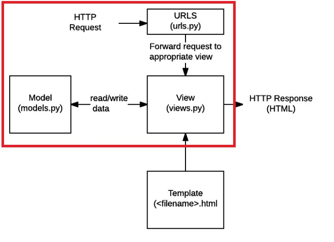
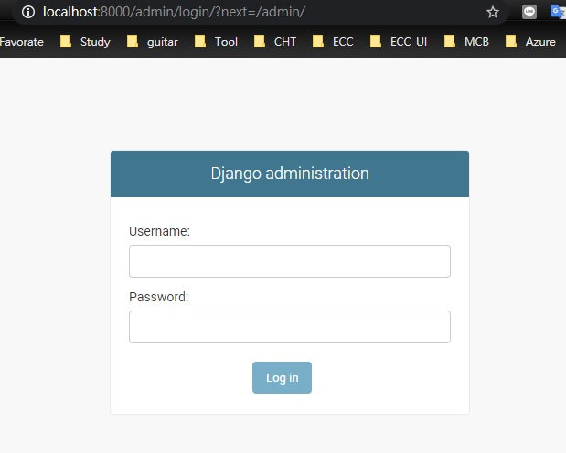
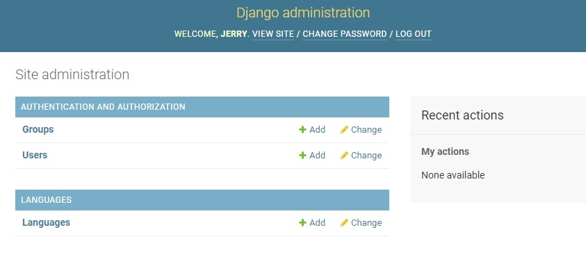
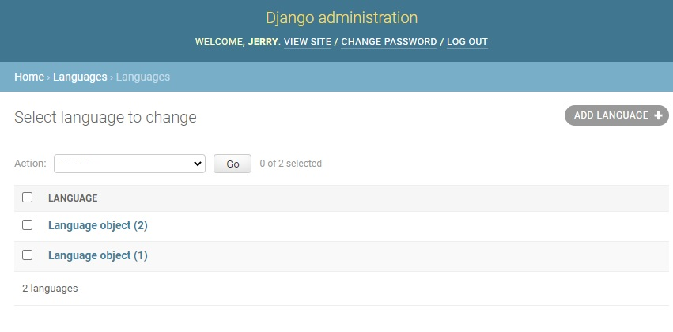
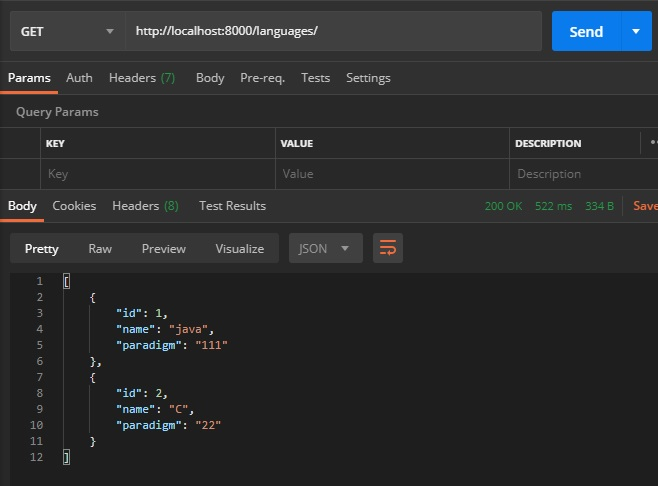
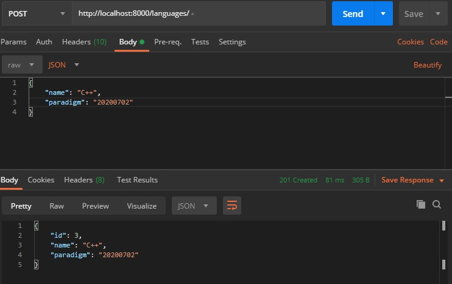

# 透過以下步驟 可以建立 Django 的 Restful api 服務， 專案說明 : 
建立 project api_example 時即會建立 WSGI (Python Web Server Gateway Interface)。
WSGI區分為兩個部份：一為「伺服器」或「閘道」，另一為「應用程式」或「應用框架」。

在處理一個WSGI請求時，伺服器會為應用程式提供環境資訊及一個回呼函式（Callback Function）。當應用程式完成處理請求後，透過前述的回呼函式，將結果回傳給伺服器。
專案內應用程式即是 "language". 

此專案透過 djangorestframework 建立 API 不包含 template html 網頁的部分(如下圖)。

https://developer.mozilla.org/zh-TW/docs/Learn/Server-side/Django/Introduction

# 前置步驟
$ pip install pipenv
```
pipenv 的優點包括以下幾個：
1. 會在專案以外的地方放置專案所需的套件
2. 自動管理套件之間的 dependency ，方便移除套件．例如安裝 pyspark 時會需要一併安裝 py4j ，如果單純使用 pip 安裝，雖然可以一併安裝，但是用 pip uninstall 移除時需要一個一個移除．這點在 pipenv 會幫忙管理，自動移除相關的 lib
3. 可以區分 dev 環境的套件，在安裝時可以選擇要不要包含 dev 環境的套件．就可以保持 prod 套件的乾淨
4. 不需要使用 activate 或 deactivate 來切換環境．pipenv 可以使用 pipenv run 來直接使用虛擬環境提供的 lib
```

# Getting Started With Django REST Framewore
https://www.django-rest-framework.org/tutorial/quickstart/
https://www.youtube.com/watch?v=263xt_4mBNc&t=0s&list=WL&index=9
## 安裝 djangorestframework framework :
    $ mkdir -p django-REST
    $ cd dango-REST\
    $ pipenv install djangorestframework
```
Success!
Updated Pipfile.lock (819182)!
    ================================ 0/0 - 00:00:00
To activate this project's virtualenv, run pipenv shell.
Alternatively, run a command inside the virtualenv with pipenv run.
```
#### Start python virtual evn. :
    $ pipenv shell
```
PS D:\workspace\Django-restapi-Pratice> pipenv shell 
Shell for C:\Users\jerry\.virtualenvs\Django-restapi-Pratice-xUWfhvPf already activated.
```

#### Create project "api_example" :
$ django-admin startproject api_example

    // it will create : api_example\ , api_example\manage.py , api_example\api_example\  

$ cd api_example
$ python manage.py migrate	

// it will create  db.sqlite3 
```
PS D:\workspace\Django-restapi-Pratice> python manage.py migrate 
Operations to perform:
    Apply all migrations: admin, auth, contenttypes, languages, sessions
Running migrations:
    Applying admin.0003_logentry_add_action_flag_choices... OK
    Applying auth.0010_alter_group_name_max_length... OK
    Applying auth.0011_update_proxy_permissions... OK
```  
#### Create superuser :
$ python manage.py createsuperuser
```
PS D:\workspace\Django-restapi-Pratice> python manage.py createsuperuser
Username (leave blank to use 'jerry'):
Email address:
Password:
Password (again):
Superuser created successfully.
```
#### Create app "language" :
$ python manage.py startapp languages

##### 編輯 api_example\api_example\settings.py 加入 app 'languages' & 'rest_framework'
```
INSTALLED_APPS = [
	'rest_framework',
	'languages',
]
```

##### 編輯 api_example\api_example\urls.py  [ 將請求發送到正確的視圖(urls.py) ]
```
urlpatterns = [
	path('admin/', admin.site.urls),
    path('', include('languages.urls')),
]
```
##### 新增檔案 api_example\languages\urls.py [ 將請求發送到正確的視圖(urls.py)]
```
from django.urls import path, include
from . import views
from rest_framework import routers

router = routers.DefaultRouter()
router.register('languages', views.LanguageView)

urlpatterns = [
   path('', include(router.urls))
]
```

#### 新增 laguages\serializers.py  : 轉 model  轉成 json (因為不能 http 直接回覆 model)
```
from rest_framework import serializers
from .models import Language

class LanguageSerializer(serializers.ModelSerializer):
    class Meta:
        model = Language
        fields = ('id', 'name', 'paradigm')
```

#### 編輯 laguages\views.py  [處理請求，跟 model 取資料 redirct 或是 render template(html) ]
```
from django.shortcuts import render
# Create your views here.
from rest_framework import viewsets
from .models import Language
from .serializers import LanguageSerializer
class LanguageView(viewsets.ModelViewSet): 
	queryset = Language.objects.all()
	serializer_class = LanguageSerializer
 ```

#### 編輯 laguages\model.py  [定義數據模型(models.py) ]
```
from django.db import models
# Create your models here.
class Language(models.Model):
	name = models.CharField(max_length=50)
	paradigm = models.CharField(max_length=50)

    #def __str__(self):
    #    return self.name
```

#### 建立 model "Language"
```
$python manage.py makemigrations
```
#### apply model "Language" => 至此已於 db 建立 Language
```
$ python manage.py migrate
```
#### Run the service
```
$ python .\manage.py runserver
```
#### 編輯 model languages\admin.py  
```
from django.contrib import admin
# Register your models here.
from .models import Language
admin.site.register(Language) 
```

#### 可以在  localhost:8000/admin 的網頁看到 Language




#### 瀏覽 http://localhost:8000
http://localhost:8000/admin


#### 用 postman 測試
```
GET http://localhost:8000/languages/
```

```
post http://localhost:8000/languages/
{"name": "C++", "paradigm": "20200702"}
```

#### router 會自己產生下面的model url 
```
http://localhost:8000/languages/2/
```


---
---
# 倘若要 react 與 django 整合

```
https://www.youtube.com/watch?v=kmpY6g5hYZI&list=WL&index=5&t=1s

在 api_example\
npx create--react-app frontend

cd frontend\

npm run build

```
# 編輯 api_example\urls.py
```
urlpatterns = [
    path('admin/', admin.site.urls),
    #path('', include('languages.urls')),
    path('language/', include('languages.urls')),
    re_path('.*', TemplateView.as_view(template_name='index.html')),
]
```
# 編輯 api_example\settings.py
```
TEMPLATES = [
    {
        'DIRS': [
            os.path.join(BASE_DIR, 'frontend', 'build'),
        ],

STATICFILES_DIRS = [
    os.path.join(BASE_DIR, 'frontend', 'build', 'static'),
]
```
# 自動化 run django & react :  
$ python .\manage.py runserver  
$ npm run build
##### 編輯 manage.py
```
try:
	if sys.argv[2] == 'react':
		project_root = os.getcwd()
		os.chdir(os.path.join(project_root, "frontend"))
		os.system("npm run build")
		os.chdir(project_root)
		sys.argv.pop(2)
except IndexError:
	execute_from_command_line(sys.argv)
else : 
	execute_from_command_line(sys.argv)
```
然後就可透過 python manage.py runserver react 自動執行以上指令


